# Cognitive Architecture

## Overview
The Actgent cognitive architecture implements a sophisticated memory and processing system inspired by human cognition. This document provides a high-level overview of the system's design, components, principles, and current assessment.

## System Assessment

### Core Components

#### Signal System (Score: 8/10)
**Strengths**:
- Clear signal type hierarchy
- Flexible configuration options
- Support for composite signals
- Efficient signal processing

**Areas for Improvement**:
- Signal filtering mechanisms
- Signal priority handling
- Signal composition patterns
- Signal frequency control

#### Monitor System (Score: 7/10)
**Strengths**:
- Clean monitor interface
- Efficient memory observation
- Clear lifecycle management
- Metrics tracking

**Areas for Improvement**:
- Monitor dependencies
- Monitor chaining
- Resource management
- Error recovery

#### Event System (Score: 7/10)
**Strengths**:
- Typed events
- Async processing
- Clear handler interface
- Rich metadata support

**Areas for Improvement**:
- Event correlation
- Event batching
- Event prioritization
- Error handling

## Memory Model

### Memory Types

#### Working Memory
- Active processing space
- Limited capacity
- Direct interaction with agent
- Automatic cleanup
- Example: Current conversation context

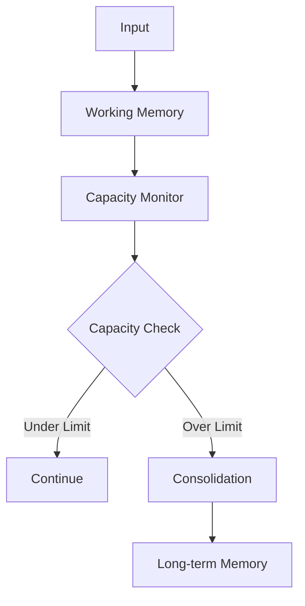

#### Episodic Memory
- Experience-based memory
- Temporal organization
- Context-aware storage
- Emotional tagging
- Example: Past conversations and interactions

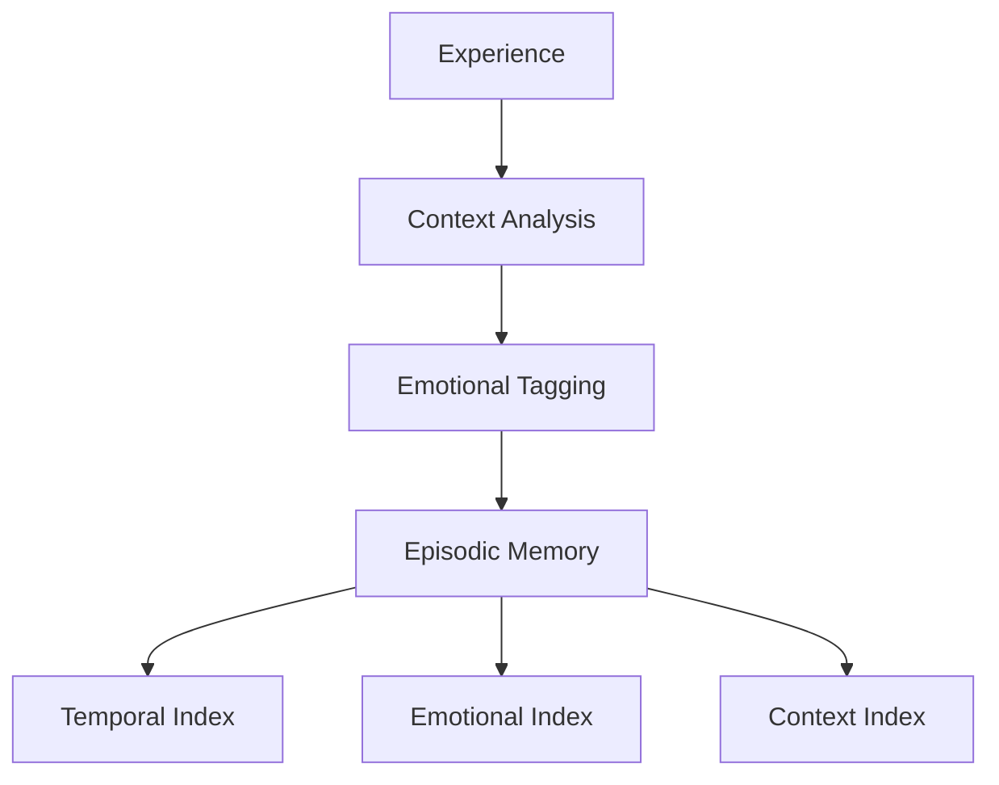

#### Semantic Memory
- Knowledge representation
- Concept graphs
- Relation networks
- Fact storage
- Example: Domain knowledge and facts

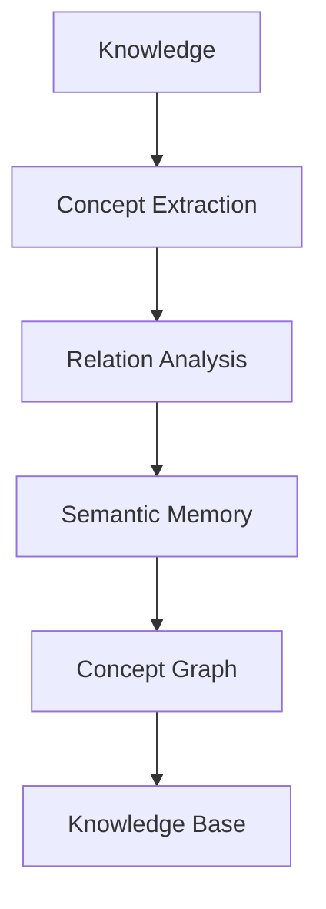

#### Procedural Memory
- Skill and task memory
- Pattern recognition
- Learning from repetition
- Action sequences
- Example: Conversation patterns and strategies

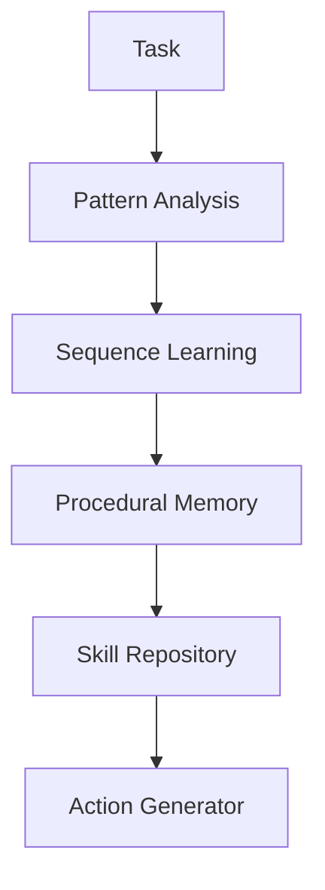

#### Ephemeral Memory
- Very short-term storage
- Cache-like behavior
- Automatic cleanup
- Quick access
- Example: Temporary calculations and state

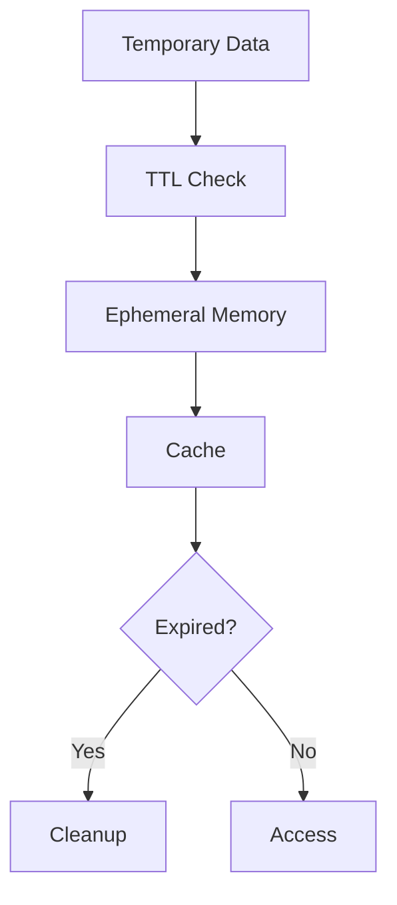

### Memory Processes

#### Consolidation Flow
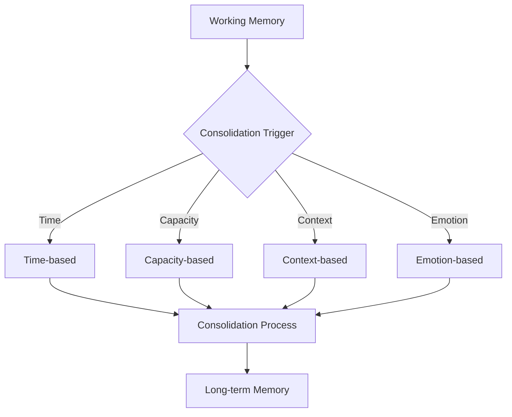

#### Association Flow
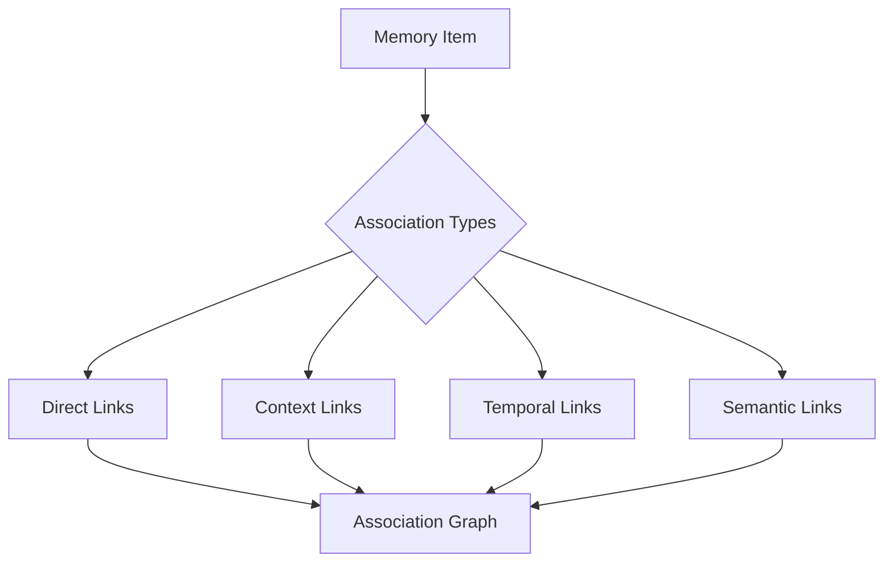

## Cognitive Processes

### Attention System
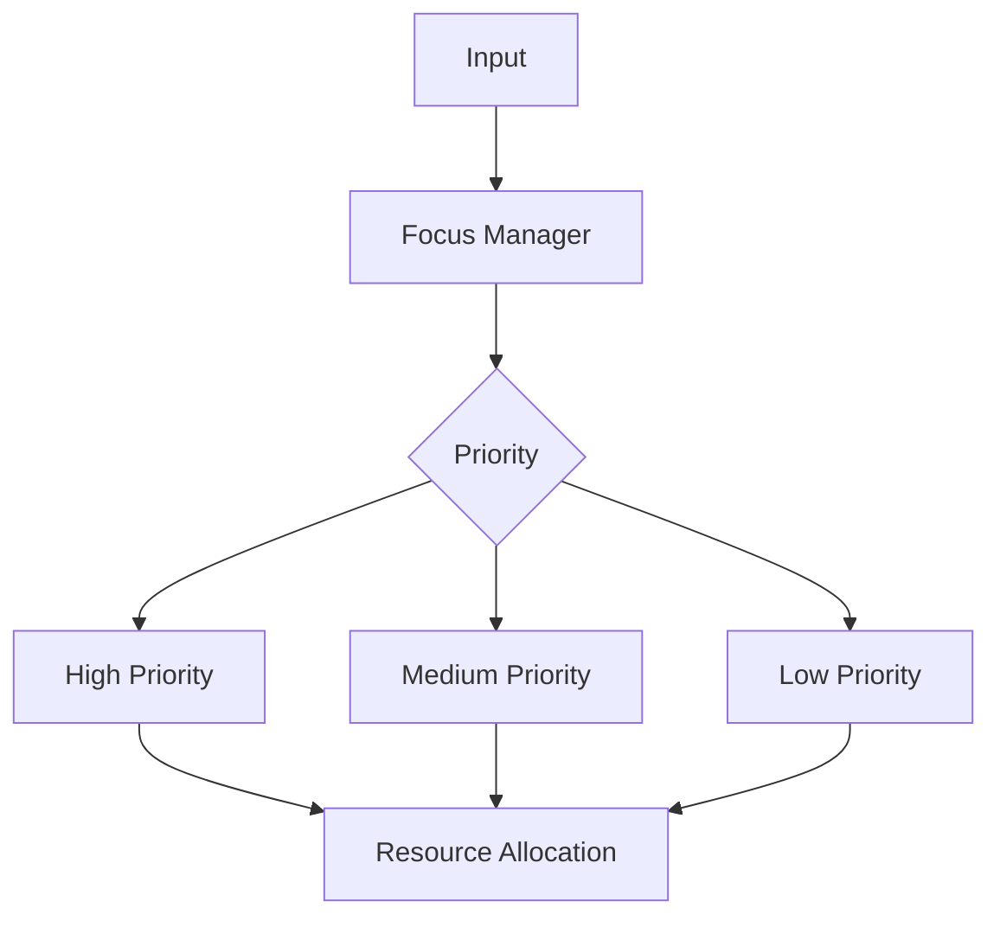

### Learning System
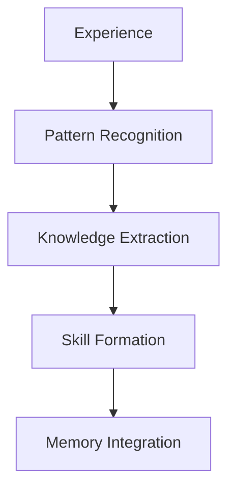

### Emotional System
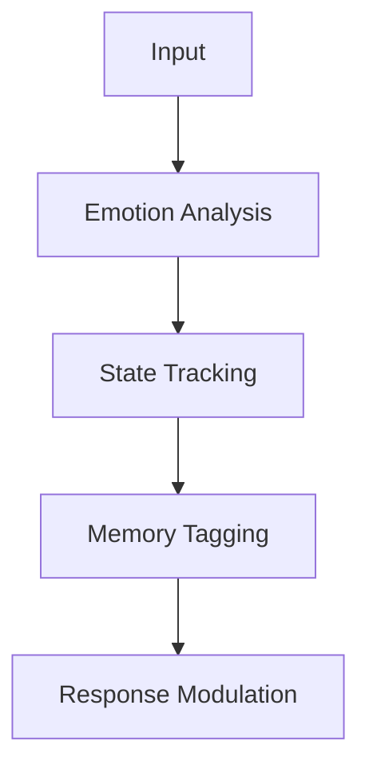

### Goal System
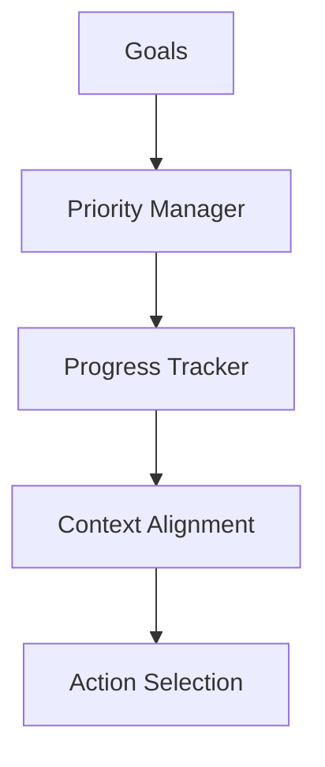

## Performance Assessment

### Signal Processing (Score: 8/10)
**Metrics**:
- Signal throughput
- Processing latency
- Resource usage
- Error rates

**Strengths**:
- Efficient signal routing
- Low latency
- Resource efficient
- Error resilient

### Memory Operations (Score: 7/10)
**Metrics**:
- Operation throughput
- Access patterns
- Cache efficiency
- Resource usage

**Strengths**:
- Fast operations
- Efficient caching
- Resource management
- Error handling

### Event Processing (Score: 7/10)
**Metrics**:
- Event throughput
- Processing latency
- Resource usage
- Error rates

**Strengths**:
- Async processing
- Low latency
- Resource efficient
- Error resilient

## Future Improvements

### 1. Signal System
- Enhanced signal composition
- Dynamic signal filtering
- Adaptive priorities
- Performance optimization

### 2. Monitor System
- Monitor dependencies
- Monitor chaining
- Resource optimization
- Error resilience

### 3. Event System
- Event correlation
- Event aggregation
- Priority handling
- Performance tuning

### 4. Memory Management
- Enhanced transitions
- Improved consolidation
- Better capacity management
- Association patterns

### 5. Integration
- Configuration options
- Performance optimization
- Resource management
- Error handling

### 6. Context Management
- Context transitions
- Context persistence
- Context recovery
- Performance tuning

## Overall Assessment

The cognitive architecture has evolved into a robust and flexible system with its signal-based design. The clear separation of signals, monitors, and events provides a solid foundation for memory management and cognitive processing.

**Strengths**:
1. Clean architecture
2. Flexible design
3. Performance focused
4. Error resilient

**Areas for Improvement**:
1. Signal composition
2. Monitor chaining
3. Event correlation
4. Resource management

**Overall Score: 7.5/10**
