# Context Management Framework

The Context Management Framework is a sophisticated system designed to handle conversation history and context in AI agents. It provides intelligent optimization strategies to maintain relevant context while managing memory constraints.

## Architecture Overview

The framework is built around several key components that work together to provide efficient context management:

```mermaid
classDiagram
    %% Core Interfaces
    class IHistoryManager {
        <<interface>>
        +addMessage(message: ConversationMessage)
        +getContext()* Promise~string~
        +optimize()* Promise~void~
    }

    class IContextOptimizer {
        <<interface>>
        +shouldOptimize(context: ContextMetrics)* boolean
        +optimize(messages: ConversationMessage[])* Promise~ConversationMessage[]~
    }

    class IContextMetric {
        <<interface>>
        +measure(messages: ConversationMessage[])* number
        +threshold: number
    }

    %% Core Classes
    class ConversationMessage {
        +id: string
        +content: string
        +role: string
        +timestamp: Date
        +relevanceScore: number
        +importance: number
        +tokens: number
    }

    class ContextMetrics {
        +tokenCount: number
        +messageCount: number
        +averageRelevance: number
        +oldestMessageAge: number
    }

    class SmartHistoryManager {
        -messages: ConversationMessage[]
        -optimizers: Map~string, IContextOptimizer~
        -metrics: Map~string, IContextMetric~
        -workingMemory: WorkingMemory
        +addMessage(message)
        +getContext()* Promise~string~
        -checkOptimizationTriggers()
        -updateMetrics()
    }

    %% Metrics and Monitors
    class TokenCounter {
        +count(text: string)* number
        +estimateTokens(text: string)* number
    }

    class TokenMetric {
        -tokenCounter: TokenCounter
        -maxTokens: number
        +measure(messages)* number
        +threshold: number
    }

    class RelevanceMetric {
        -relevanceEvaluator: RelevanceEvaluator
        -minRelevance: number
        +measure(messages)* number
        +threshold: number
    }

    class AgeMetric {
        -maxAge: number
        +measure(messages)* number
        +threshold: number
    }

    %% Optimizers
    class SummarizationOptimizer {
        -summarizationEngine: SummarizationEngine
        -tokenMetric: TokenMetric
        +shouldOptimize(metrics)* boolean
        +optimize(messages)* Promise~ConversationMessage[]~
    }

    class RelevanceOptimizer {
        -relevanceEvaluator: RelevanceEvaluator
        -relevanceMetric: RelevanceMetric
        +shouldOptimize(metrics)* boolean
        +optimize(messages)* Promise~ConversationMessage[]~
    }

    class TimeDecayOptimizer {
        -ageMetric: AgeMetric
        -decayFactor: number
        +shouldOptimize(metrics)* boolean
        +optimize(messages)* Promise~ConversationMessage[]~
    }

    %% Core Components
    class SummarizationEngine {
        +summarize(messages: ConversationMessage[])* Promise~string~
        -extractKeyPoints(messages)* string[]
        -generateSummary(points)* string
    }

    class RelevanceEvaluator {
        +evaluateRelevance(message, context)* number
        -computeSimilarity(text1, text2)* number
        -extractKeywords(text)* string[]
    }

    %% Integration with Existing System
    class EnhancedContextManager {
        -historyManager: SmartHistoryManager
        -workingMemory: WorkingMemory
        -context: Map~string, any~
        +addMessage(message)
        +getContext()
        +optimize()
    }

    %% Relationships
    SmartHistoryManager ..|> IHistoryManager
    SmartHistoryManager o-- IContextOptimizer
    SmartHistoryManager o-- IContextMetric
    SmartHistoryManager --> ConversationMessage

    TokenMetric ..|> IContextMetric
    RelevanceMetric ..|> IContextMetric
    AgeMetric ..|> IContextMetric

    SummarizationOptimizer ..|> IContextOptimizer
    RelevanceOptimizer ..|> IContextOptimizer
    TimeDecayOptimizer ..|> IContextOptimizer

    TokenMetric --> TokenCounter
    RelevanceMetric --> RelevanceEvaluator
    
    SummarizationOptimizer --> SummarizationEngine
    SummarizationOptimizer --> TokenMetric
    
    RelevanceOptimizer --> RelevanceEvaluator
    RelevanceOptimizer --> RelevanceMetric
    
    TimeDecayOptimizer --> AgeMetric

    EnhancedContextManager --> SmartHistoryManager
    EnhancedContextManager --> WorkingMemory
```



## Core Components

### Message Management

1. **ConversationMessage**
   - Represents individual messages in the conversation
   - Tracks metadata like relevance, importance, and token count
   - Includes timestamp for age-based optimizations

2. **SmartHistoryManager**
   - Core component managing conversation history
   - Implements optimization strategies
   - Integrates with WorkingMemory for persistence
   - Maintains metrics for optimization decisions

### Metrics System

The framework uses three types of metrics to monitor conversation state:

1. **TokenMetric**
   - Tracks token usage to prevent context overflow
   - Uses TokenCounter for accurate token counting
   - Triggers optimization when token limit is approached

2. **RelevanceMetric**
   - Measures message relevance to current context
   - Uses RelevanceEvaluator for semantic analysis
   - Helps maintain contextual coherence

3. **AgeMetric**
   - Tracks message age
   - Enables time-based context management
   - Supports automatic context pruning

### Optimization Strategies

Three main optimizers work together to maintain optimal context:

1. **SummarizationOptimizer**
   - Condenses long conversations into summaries
   - Triggered by token count thresholds
   - Uses SummarizationEngine for intelligent summarization

2. **RelevanceOptimizer**
   - Filters out irrelevant messages
   - Maintains contextual coherence
   - Uses RelevanceEvaluator for semantic analysis

3. **TimeDecayOptimizer**
   - Applies time-based importance decay
   - Removes outdated context
   - Configurable decay factor

## Integration

### EnhancedContextManager

The EnhancedContextManager provides high-level context management:
- Integrates with existing WorkingMemory system
- Manages conversation history through SmartHistoryManager
- Provides context optimization and retrieval

## Usage

```typescript
// Initialize context management
const workingMemory = new WorkingMemory();
const contextManager = new EnhancedContextManager(workingMemory);

// Add new message
const message: ConversationMessage = {
    id: 'msg-1',
    content: 'Hello, how can I help?',
    role: 'assistant',
    timestamp: new Date(),
    relevanceScore: 1,
    importance: 1,
    tokens: 8
};
contextManager.addMessage(message);

// Get optimized context
const context = await contextManager.getContext();
```

## Best Practices

1. **Message Management**
   - Set appropriate relevance scores for messages
   - Include accurate token counts
   - Use meaningful importance values

2. **Optimization**
   - Configure thresholds based on your use case
   - Monitor optimization frequency
   - Adjust decay factors for your needs

3. **Integration**
   - Use EnhancedContextManager for high-level operations
   - Implement custom metrics if needed
   - Extend optimizers for specific requirements

## Performance Considerations

1. **Token Counting**
   - Use estimateTokens() for quick checks
   - Cache token counts when possible
   - Batch token counting operations

2. **Optimization Triggers**
   - Balance optimization frequency
   - Use appropriate thresholds
   - Consider async optimization for large contexts

3. **Memory Usage**
   - Monitor working memory size
   - Use appropriate cleanup intervals
   - Implement proper garbage collection

## Future Improvements

1. **Enhanced Metrics**
   - Semantic coherence scoring
   - Topic-based relevance
   - User interaction patterns

2. **Advanced Optimizations**
   - Multi-stage summarization
   - Contextual compression
   - Adaptive thresholds

3. **Integration Features**
   - Real-time optimization
   - Custom optimization strategies
   - Enhanced persistence options
