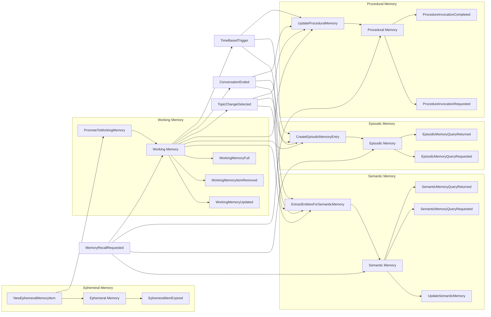

```mermaid
graph LR
    subgraph Ephemeral Memory
        EM["Ephemeral Memory"]
        NewEphemeralMemoryItem["NewEphemeralMemoryItem"] --> EM
        EM --> EphemeralItemExpired["EphemeralItemExpired"]
    end
    
    subgraph Working Memory
        WM["Working Memory"]
        PromoteToWM["PromoteToWorkingMemory"] --> WM
        WM --> WorkingMemoryUpdated["WorkingMemoryUpdated"]
        WM --> WorkingMemoryItemRemoved["WorkingMemoryItemRemoved"]
        WM --> WorkingMemoryFull["WorkingMemoryFull"]
    end
    
    subgraph Semantic Memory
        SM["Semantic Memory"]
        ExtractEntities["ExtractEntitiesForSemanticMemory"] --> SM
        SM --> UpdateSM["UpdateSemanticMemory"]
        SM --> SMQueryRequested["SemanticMemoryQueryRequested"]
        SM --> SMQueryReturned["SemanticMemoryQueryReturned"]
    end
    
    subgraph Episodic Memory
        EP["Episodic Memory"]
        CreateEP["CreateEpisodicMemoryEntry"] --> EP
        EP --> EPQueryRequested["EpisodicMemoryQueryRequested"]
        EP --> EPQueryReturned["EpisodicMemoryQueryReturned"]
    end

    subgraph Procedural Memory
        PM["Procedural Memory"]
        UpdatePM["UpdateProceduralMemory"] --> PM
        PM --> ProcInvoked["ProcedureInvocationRequested"]
        PM --> ProcInvCompleted["ProcedureInvocationCompleted"]
    end

    NewEphemeralMemoryItem --> PromoteToWM
    WM --> ExtractEntities
    WM --> CreateEP
    WM --> UpdatePM

    WM --> TopicChange["TopicChangeDetected"]
    WM --> ConvEnded["ConversationEnded"]
    WM --> TimeBasedTrigger["TimeBasedTrigger"]

    TopicChange --> ExtractEntities
    ConvEnded --> ExtractEntities
    TimeBasedTrigger --> ExtractEntities
    TopicChange --> CreateEP
    ConvEnded --> CreateEP
    TimeBasedTrigger --> CreateEP
    TopicChange --> UpdatePM
    ConvEnded --> UpdatePM
    TimeBasedTrigger --> UpdatePM
    
    MemoryRecall["MemoryRecallRequested"] --> SM
    MemoryRecall --> EP
    MemoryRecall --> WM
    MemoryRecall --> PM
```
